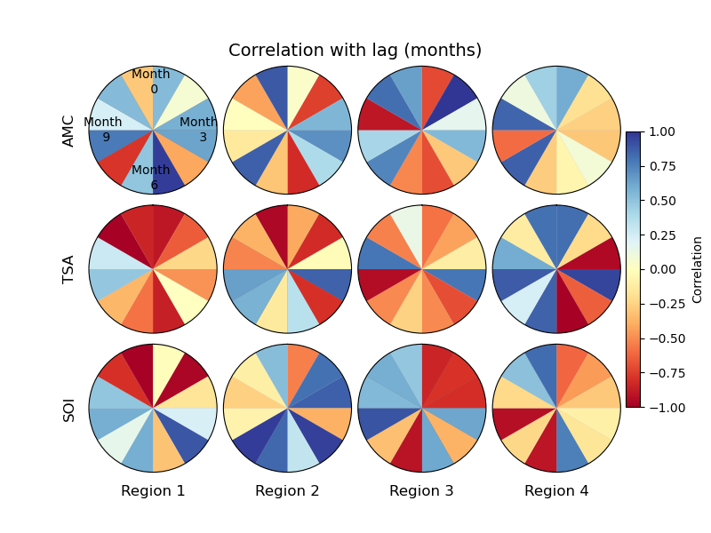
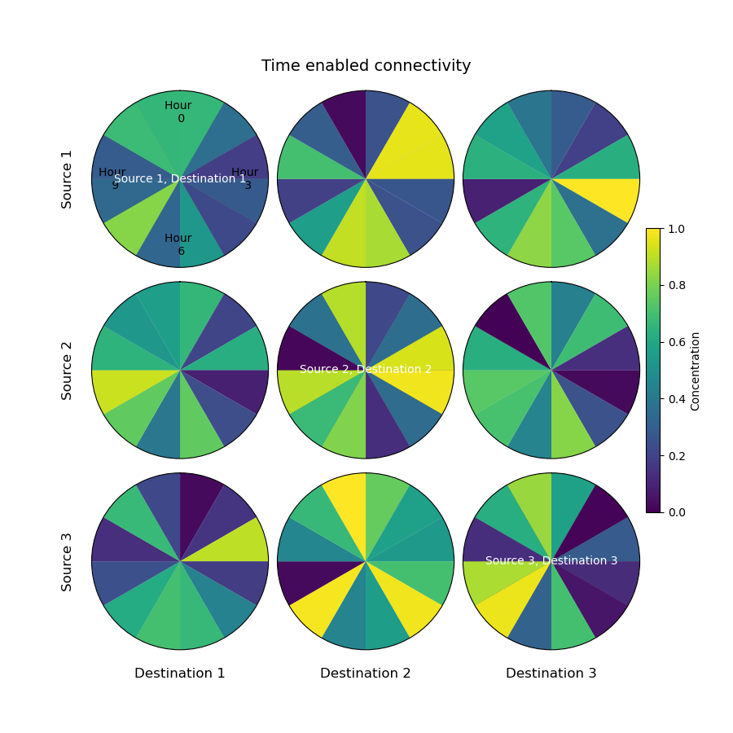

# Relation Clock Matrix (aka. Retention Clock Matrix)

This code generate a Relation Clock Matrix (RCM) plot for a given input. The inputs are a matrix with tree dimensions and a configuration file. Configuration file is a yaml file with options for changing figure settings and the matrix should have the dimensions of [time] and space [x,y] i.e. `rc_matrix[time, y, x]`. 

## Usage

```
fig = plot_rcm(rc_matrix, "rcm_config.yaml")
```

## Settings
Figure settings can be adjusted in the configuration yaml file with a text editor. Two samples are available: 

[rcm_config_correlation.yaml](https://github.com/zdefne-usgs/RCM/blob/main/rcm_config_correlation.yaml)

[rcm_config_concentration.yaml](https://github.com/zdefne-usgs/RCM/blob/main/rcm_config_concentration.yaml)

## Example outputs

The space dimensions could be a pair of related entities. For example, in the case of plotting correlation between parameters, the space dimensions can be pairs of parameters while the values can indicate the correlaltion for each pair and the time dimension can show the time lag.     



**Figure 1.** Example for plotting time lagged correlation between parmeters in multiple regions.

<br>

In the case of particle tracking the three dimensions can be time, source and destination locations, and the values can indicate concentration of particles changing in time. 



**Figure 2.** Example for plotting change in concentration of particles from one region to another.

# Example application: RCM for plotting connectivity in a bay

In tihs case the clock shows cahnge in concentartion of particles in a location:

 

**Figure 3. (a)** An example retention clock, where time t progresses clockwise from 0 to a time scale T as particle concentration P decreases from 1 to 0. Each slice represents the granularity of temporal resolution Δt centered around time ti. Retention clock examples for domains with different particle retention characteristics: **(b)** rapidly dispersing, **(c)** mostly retaining, **(d)** both dispersing and recruiting, and **(e)** recruiting.

An RCM plot is generated for displaying exchange of particles between 15 spatially distributed polygons in time. 


**Figure 4.** Map showing 15 polygons in the bay. Particles carrying the information on source polygon are released at each polygon and their concentration at each polygon in time is measured.   


**Figure 5.** The resulting RCM plot shows source and destination polygons together with the concnetration of particles at each polygon in time.  

**For full text see:**

Defne, Z., N. K. Ganju, and A. Aretxabaleta (2016), Estimating time-dependent connectivity in marine systems, Geophys. Res. Lett., 43, 1193–1201, [doi:10.1002/2015GL066888](https://doi.org/10.1002/2015GL066888)
