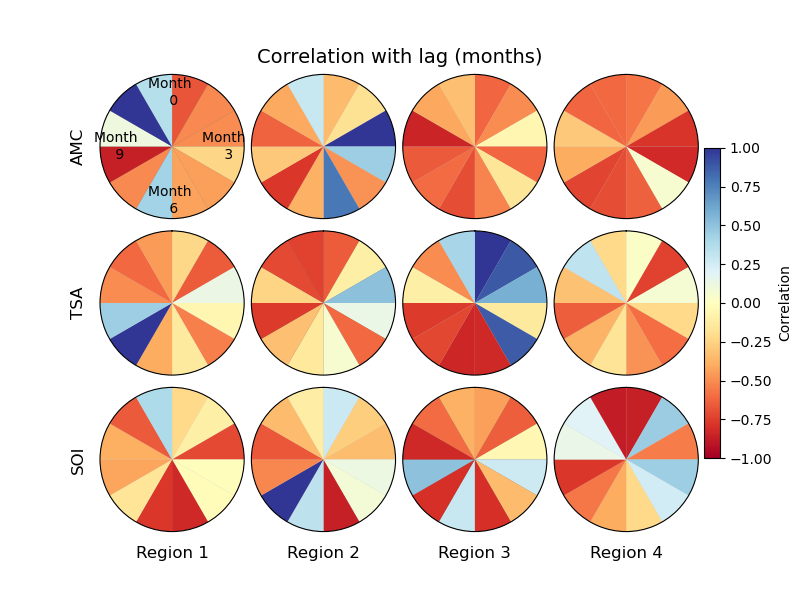
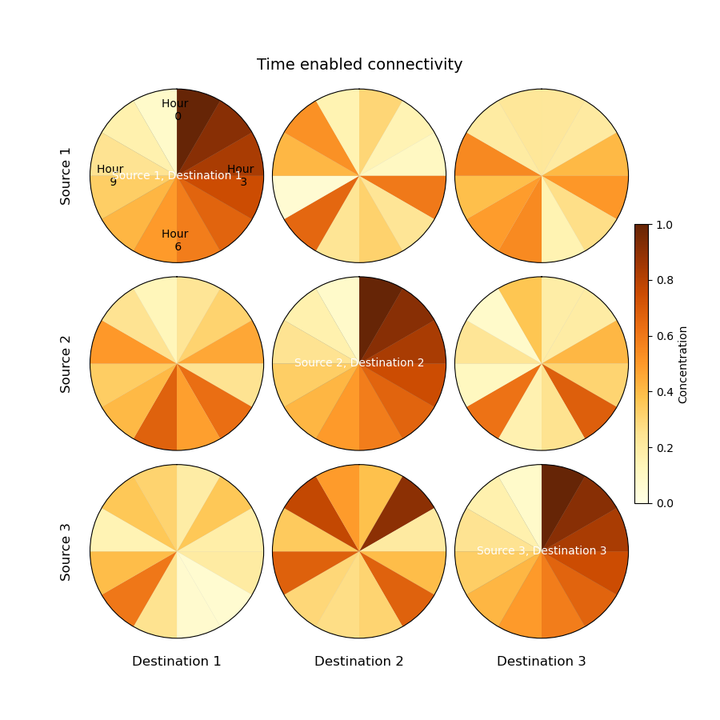

# Relation Clock Matrix (aka. Retention Clock Matrix)

This code generate a Relation Clock Matrix (RCM) plot for a given input. The inputs are a matrix with tree dimensions and a settings file. SEttings file is a yaml file with options and the matrix should have the dimensions of [time] and space [x,y] i.e. `rc_matrix[time, y, x]`. 

## Usage

```
fig = plot_rcm(rc_matrix, "rcm_setting.yaml")

```

## Settings
Settings can be adjusted with the included yaml file. 


[rcm_setting.yaml](https://github.com/zdefne-usgs/RCM/blob/main/rcm_input.yaml)

## Example outputs

The connectivity dimensions could be a pair of related entities. For example, in case of particle tracking it the three dimensions are going to be time, source and destination locations, and the values indicate concentration of particles (see example below). In the case of a correlation between parameters, the connectivity dimensions will be each pair of parameters while the values indicate the correlaltion for that pair and the time dimension can show the time lag.     



**Figure 1.** Example for plotting correaltion between parmeters in multiple regions with time lag.



**Figure 2.** Example for plotting concentration within different regions with time.

# Example application: RCM for plotting connectivity in a bay

In tihs case the clock shows cahnge in concentartion of particles in a location:

 

**Figure 3. (a)** An example retention clock, where time t progresses clockwise from 0 to a time scale T as particle concentration P decreases from 1 to 0. Each slice represents the granularity of temporal resolution Δt centered around time ti. Retention clock examples for domains with different particle retention characteristics: **(b)** rapidly dispersing, **(c)** mostly retaining, **(d)** both dispersing and recruiting, and **(e)** recruiting.

An RCM plot is generated for displaying exchange of particles between 15 spatially distributed polygons in time. 


**Figure 4.** Map showing 15 polygons in the bay. Particles carrying the information on source polygon are released at each polygon and their concentration at each polygon in time is measured.   


**Figure 5.** The resulting RCM plot shows source and destination polygons together with the concnetration of particles at each polygon in time.  

**For full text see:**

Defne, Z., N. K. Ganju, and A. Aretxabaleta (2016), Estimating time-dependent connectivity in marine systems, Geophys. Res. Lett., 43, 1193–1201, [doi:10.1002/2015GL066888](https://doi.org/10.1002/2015GL066888)
